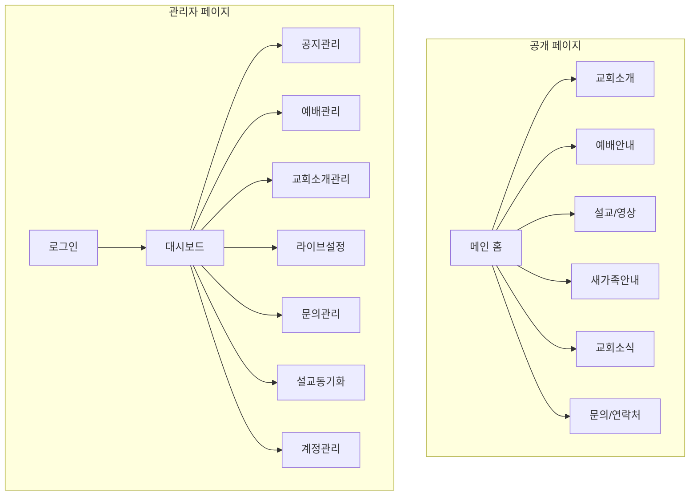
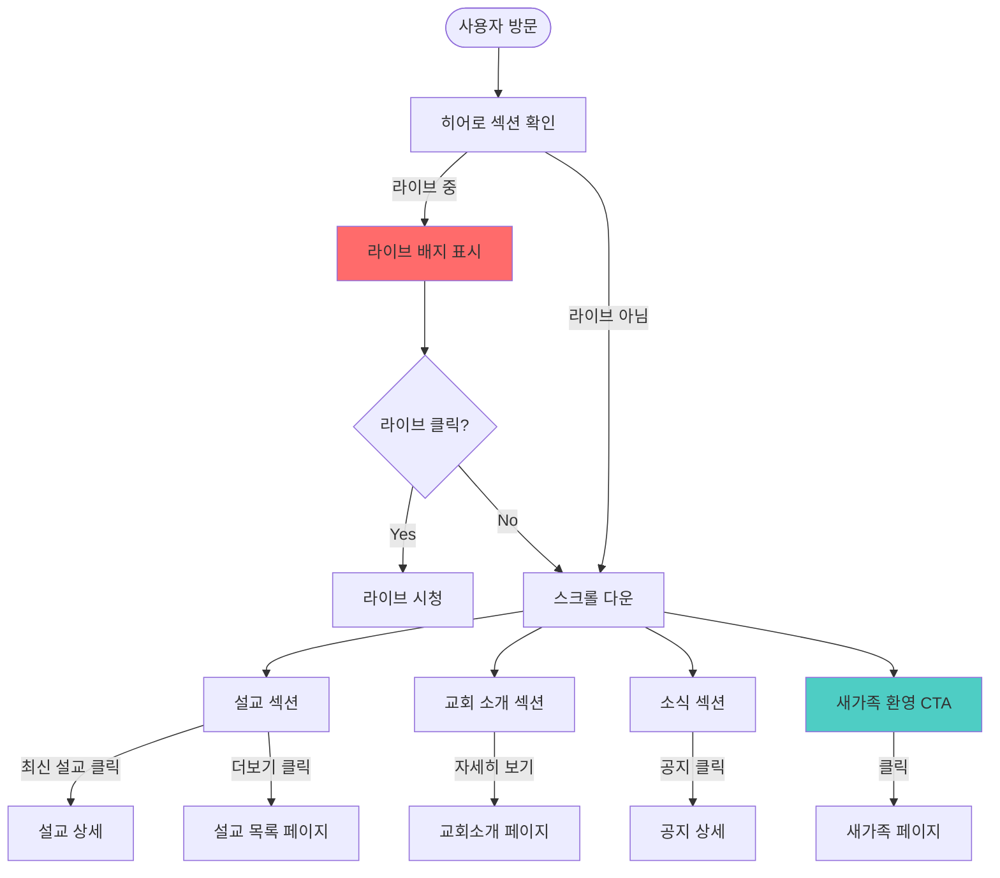
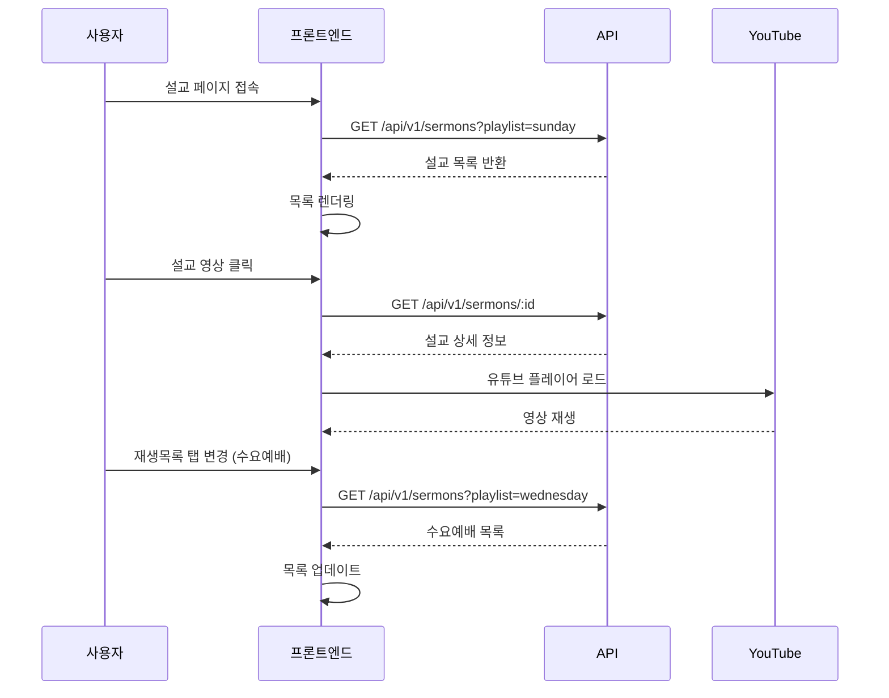
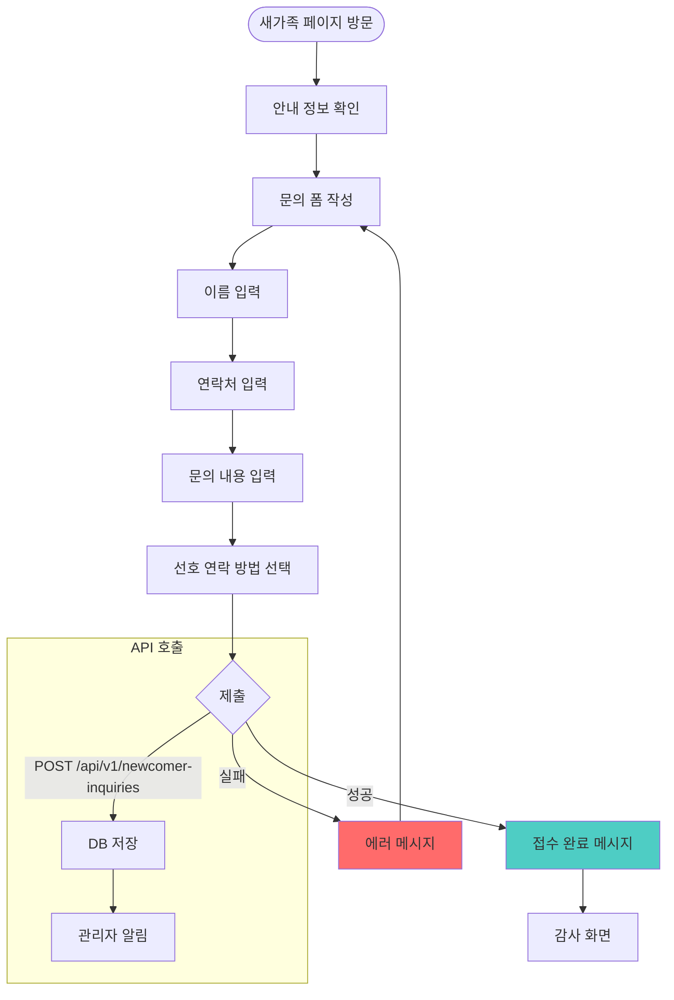
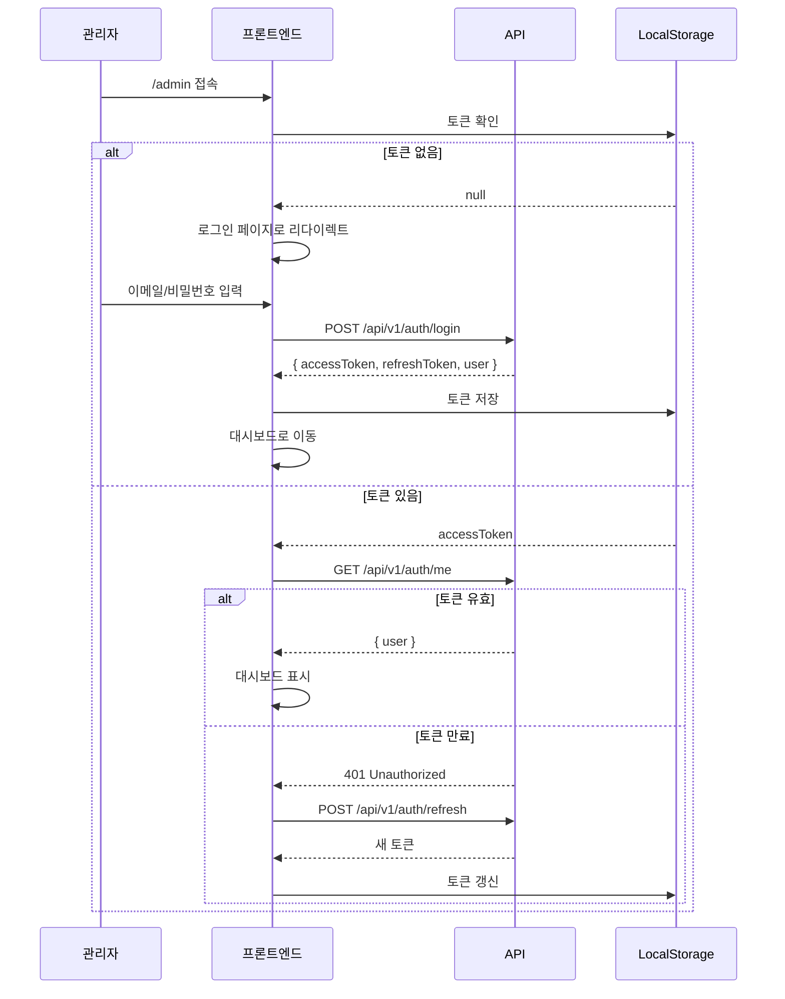
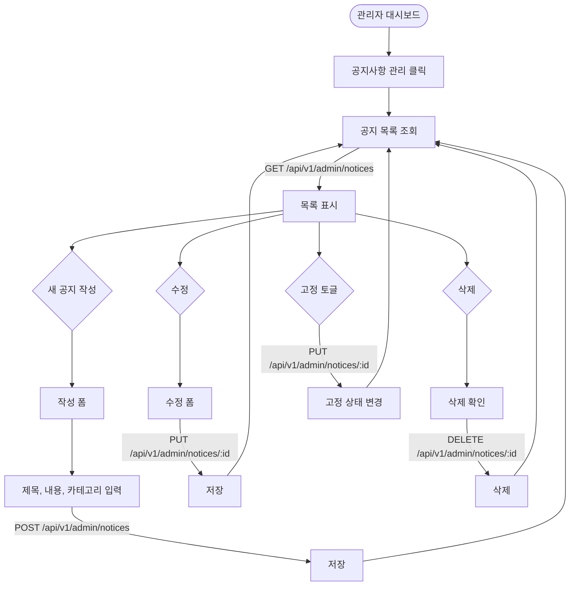
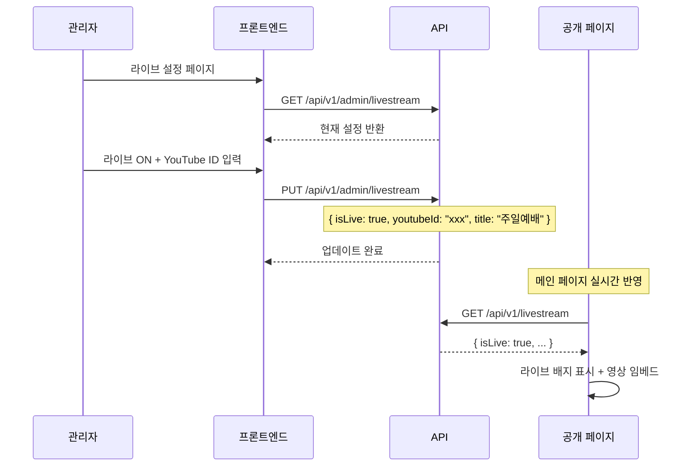
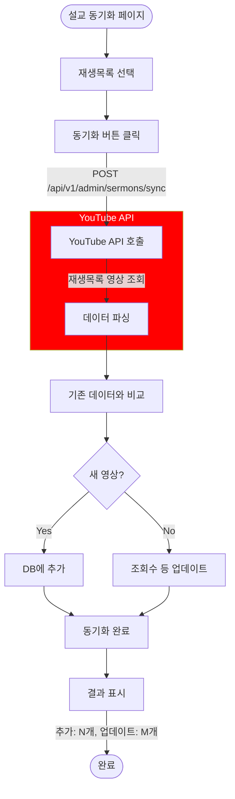
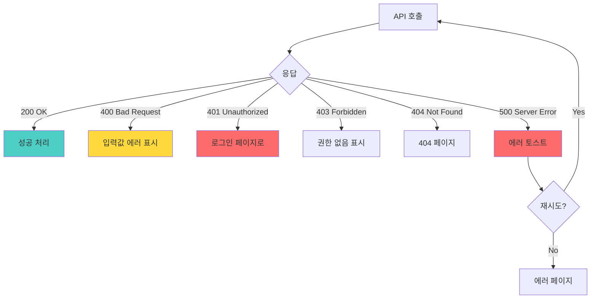

# User Flow: 성락교회 웹페이지

## 1. 전체 사이트맵

## 2. 메인 페이지 사용자 흐름

## 3. 설교 시청 흐름

## 4. 새가족 문의 흐름

## 5. 관리자 로그인 흐름

## 6. 공지사항 관리 흐름

## 7. 라이브 스트림 설정 흐름

## 8. 유튜브 설교 동기화 흐름

## 9. 페이지별 API 호출 매핑

| 페이지 | 초기 로드 API | 사용자 액션 API |
|--------|--------------|----------------|
| **메인** | `GET /sermons/latest` `GET /notices?size=3` `GET /livestream` | - |
| **교회소개** | `GET /church-info` | - |
| **예배안내** | `GET /worships` | - |
| **설교/영상** | `GET /sermons` | `GET /sermons?playlist=xxx` `GET /sermons/:id` |
| **새가족** | - | `POST /newcomer-inquiries` |
| **교회소식** | `GET /notices` | `GET /notices/:id` |
| **관리자 로그인** | - | `POST /auth/login` |
| **관리자 대시보드** | `GET /admin/newcomer-inquiries?size=5` | - |

## 10. 에러 처리 흐름

